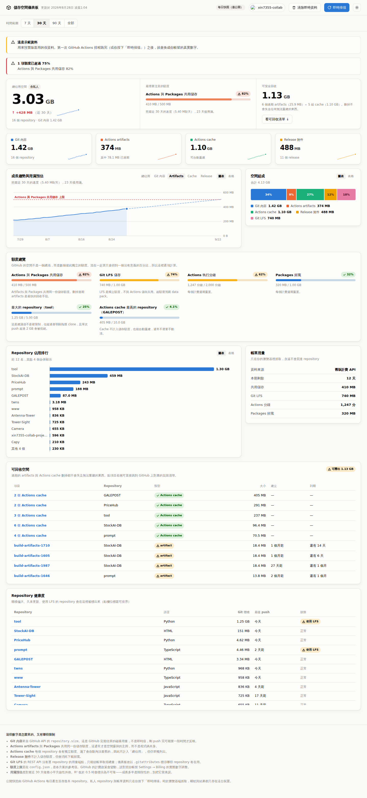

# GitHub 儲存空間儀表板

監控自己 GitHub 帳號還剩多少空間、空間被什麼吃掉、以及照這個速度還有幾天會滿。



## 為什麼不是一個數字就好

GitHub 的「空間」不是一個總池，而是**數個彼此獨立的額度**，各有各的上限與計費方式：

| 項目 | 額度 | 備註 |
|---|---|---|
| Git 內容 | 建議單一 repo < 5 GB | 軟性建議，但單次 push 超過 2 GB 會被拒絕 |
| Actions artifacts + Packages | 共用同一份儲存額度 | **最常爆掉的一項**，且和程式碼大小無關。**只算私人 repo** |
| Actions cache | 每個 repo 各 10 GB | 不計入儲存額度，滿了會自動淘汰最舊的 |
| Release 附件 | 不計入儲存額度 | 但會消耗下載頻寬 |
| Git LFS | 獨立額度 | 超額要另外買 data pack |
| Actions 分鐘數 | 每個計費週期重置 | 公開 repo 不計費 |

把它們加總平均成一個百分比只會得到一個沒有意義的數字，所以儀表板一律逐項計算，各自帶自己的上限與說明。

## 快速開始

1. **開啟 Pages**：Settings → Pages → Source 選 **GitHub Actions**。
2. **跑第一次快照**：Actions → 「每日儲存空間快照」→ Run workflow。
3. 打開 `https://<你的帳號>.github.io/Dashboard/`。

之後每天 UTC 19:30（台北 03:30）會自動更新一次。

> 想先看看長什麼樣子，在網址後面加 `?demo=1` 會載入示範資料。

## 兩種資料來源

| | 每日快照 | 即時掃描 |
|---|---|---|
| 觸發 | GitHub Actions 排程 | 你按右上角按鈕 |
| 涵蓋 | 只有公開 repo | 私人 repo、Git LFS、帳單用量 |
| 資料位置 | commit 進本 repo（`data/`） | **只留在你的瀏覽器** |
| 歷史趨勢 | 有，逐日累積 | 有，存在 localStorage |

這是刻意的設計：快照要 commit 才能累積歷史、才能公開分享，所以裡面絕不放私人資料；私人 repo 名稱與帳單數字只在你自己的瀏覽器裡出現，權杖也一樣。

### 即時掃描需要的權杖權限

到 [Fine-grained tokens](https://github.com/settings/personal-access-tokens/new) 建立：

- Repository access：**All repositories**
- Repository permissions：`Metadata: Read`、`Actions: Read`、`Contents: Read`
- Account permissions：`Plan: Read` ← 帳單用量需要這個

### 想讓排程也涵蓋所有 repo

Workflow 預設用內建的 `GITHUB_TOKEN`，它只看得到**本 repo** 的 Actions 資料。要讓排程掃描你所有的 repo，到 Settings → Secrets and variables → Actions 新增一個名為 `DASHBOARD_TOKEN` 的 secret，內容是上面那組權杖。

⚠️ 如果你同時把採集範圍改成 `all`，私人 repo 的名稱與體積就會被 commit 進這個 repo。**只有在這個 repo 是私有的時候才這樣做。**

## 設定

全部在 `config.json`：

```jsonc
{
  "account": "你的帳號",
  "plan": "free",              // free / pro / team / enterprise
  "quotas": { ... },           // 各方案的額度上限
  "alerts": {
    "warnPercent": 75,         // 超過就在儀表板示警、並開 Issue
    "criticalPercent": 90,
    "staleRepoDays": 180       // 多久沒 push 算「陳舊」
  }
}
```

**額度數字是各方案的參考值，不是從 API 讀來的。** GitHub 的計費政策會變動，請對照你帳號 Settings → Billing 的實際數字調整。

## 本機執行

```bash
node scripts/snapshot.mjs          # 產生快照到 data/
python3 -m http.server 8000        # 沒有建置步驟，直接開
```

需要 Node 18+（用到內建 `fetch`）。**零相依套件**，沒有 `package.json`，沒有 `node_modules`。

## 這些數字的限制

誠實地講清楚比畫得漂亮重要：

- **`repository.size` 是 GitHub 定期估算的磁碟用量，不是即時值。** 剛 push 完可能要一段時間才反映，而且它包含了什麼、不包含什麼，GitHub 並沒有明確文件化。
- **Git LFS 沒有逐 repo 的 REST 端點。** 總量只能從帳單拿；儀表板改以 `.gitattributes` 標示哪些 repo 有在用 LFS。
- **Packages 的體積 API 不提供。** 只能從帳單看到共用儲存的總量。
- **帳單 API 有新舊兩套。** GitHub 正在把帳號遷移到新版計費平台，採集器會先試新版再退回舊版，兩套都失敗就顯示為「無資料」而不是猜一個數字。
- **用滿預估是對最近 30 天做最小平方線性外推。** R² 低於 0.5 時會標示為不可靠 —— 儲存成長多半是階段性的，別把它當承諾。
- **顯示單位用 1000 進位**（KB/MB/GB），這樣畫面上的數字才和 GitHub 標示的額度對得起來。
- **公開 repository 的 Actions 儲存與分鐘數免費**，不計入共用儲存額度。因此「Actions artifacts」顯示的是實際磁碟佔用，而「共用儲存」額度只算私人 repository。實測過：14 個公開 repo 有 4.9 GB 的 artifacts，而 GitHub 帳單回報的計費儲存是 0。早期版本把兩者混在一起算，會叫出 991% 的假警報。

抓不到的資料一律顯示為「—」並在頂端掛出「資料不完整」橫幅，不會用 0 假裝沒事。

## 結構

```
index.html              整個站台的入口，沒有建置步驟
config.json             額度與警戒門檻
assets/js/
  github.js             REST 客戶端：分頁、速率限制、軟失敗
  collect.js            採集邏輯（Node 與瀏覽器共用同一份）
  quota.js              額度模型、線性外推、可回收空間彙總
  charts.js             手寫 SVG 圖表元件
  ui.js                 版面組裝
  app.js                啟動、狀態、主題、權杖
scripts/snapshot.mjs    Actions 用的 Node 進入點
data/                   快照與歷史（由 Actions 產生）
```

## 無障礙與視覺規範

- 類別配色通過色盲安全驗證（相鄰色對 CVD ΔE ≥ 8、一般視覺 ΔE ≥ 15），深淺兩色系各自選色而非自動反轉。
- 每張圖都有等價的**表格檢視**，狀態一律「圖示 + 文字 + 顏色」三重編碼，顏色從不單獨表意。
- 圖表支援鍵盤操作（方向鍵瀏覽資料點），支援 `prefers-reduced-motion`。
